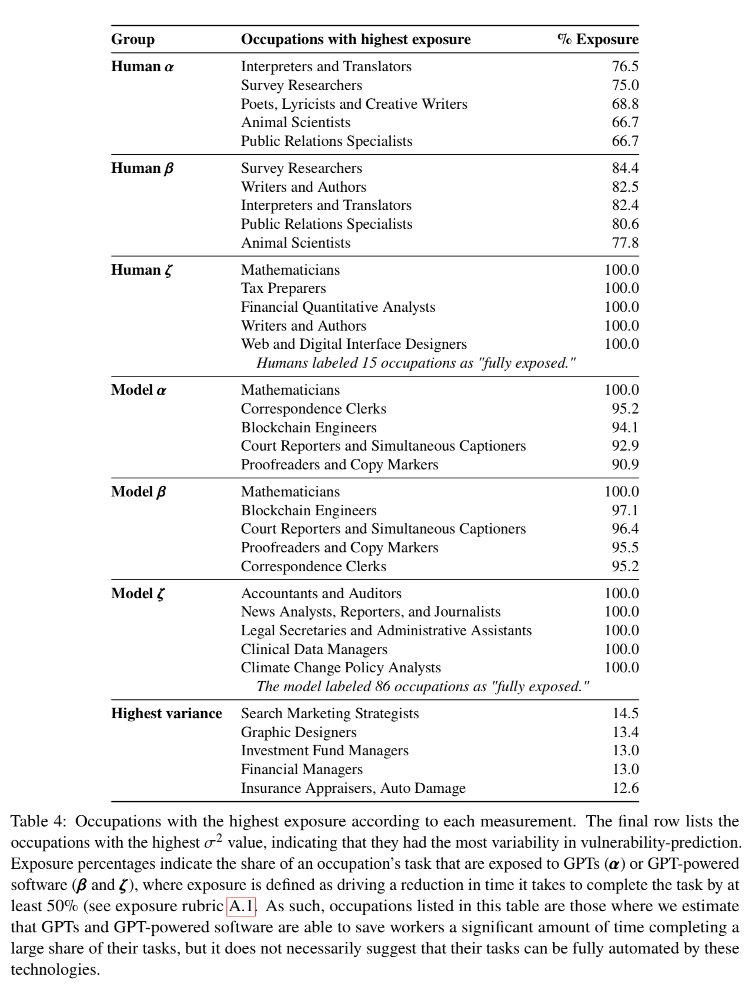

# Impact of LLMs on labor market - Research and paper from OpenAI/Wharton on 3/20/23

*Chatgpt4 was down today so I ended up summarizing below on my own after going through Chatgpt withdrawl symptoms.* :disappointed:

Read the paper for additional details, measurements and evaluation approaches/considerations, drawbacks, caveats, etc. at https://arxiv.org/pdf/2303.10130.pdf

## Assumptions made in the paper

* Analyze US labor market
* Maintain current socio/economic/labor policies
* Products available to facilitate jobs - LLMs (ChatGPT/other LLMs) and LLM+ (current and new tools to be built on these LLM platforms; i.e., no co-invention barrier to produce LLM+)
* Analysis done at occupation, tasks levels and skills (Note: occupation => daily-work-activities => list of tasks => skills required)
* Analysis defines and uses 5 job-zones/categories that are similar in (a) the level of education needed to get a job in the occupation, (b) the amount of related experience required to do the work, and (c) the extent of on-the-job training needed to do the work.

    | Job Zones | Example Jobs                      | Median Incomes |
    | --------- | -------------------------------- | -------------- |
    | Jobzone1  | Dishwashers, Floor Sanders        | $30K           |
    | Jobzone2  | CS-Reps, Tellers                  | $38K           |
    | Jobzone3  | Electricians, MAs                 | $55K           |
    | Jobzone4  | DB-Admins, Graphics Designers      | $77.5K         |
    | Jobzone5  | Pharmacists, Lawyers, Astronomers | $81K           |

* Use BLS (labor statistics) and ONET occupations/daily-work-activities/tasks classification as a basis of analysis of the above bullet
* Assume a somewhat arbitrary threshold is HALF: I.e., half time is now required with direct LLM products to complete the task for all direct LLM exposure tasks as against with LLM
* Assume that 50% of tasks that are exposed with additional tools based on LLM+ will save half the time (less benefits due to additional time investment in deploying the technology via complementary tools and applications)
* Assume core tasks receive twice the weight as compared to supplemental tasks in an occupation when calculating avg exposure scores to LLM/LLM+
* Analysis published based on BLS/ONET occupations/tasks analysis by GPT-4 Rubric 1 (defined in the paper). Other methods also used, though most of the times, correlates pretty well with human annotations analysis as well).

## Abstract Highlights from the Paper

* ~80% of the U.S. workforce could have at least 10% of their work tasks affected by the introduction of LLM/LLM+
* ~19% of workers may see at least 50% of their tasks impacted
* Influence spans all wage levels, with higher-income jobs potentially facing greater exposure
* Impact is not limited to industries with higher recent productivity growth

## Additional Notable Takeaways

* 15% of tasks are directly exposed to LLM.
* 30% of tasks are exposed to both LLM and LLM+.
* Higher wages are associated with increased exposure to LLM/LLM+, though numerous lower wage occupations also demonstrate high exposure based on study rubrics.
* Table 5 has detailed results of skills strongly positively impacted due to LLM/LLM+ exposure, which may pose a risk of reduction in employment.
  * Programming and writing skills.
* On the other hand, science and critical thinking skills are negatively correlated with exposure to LLM/LLM+, indicating that they are less likely to be impacted by LLM/LLM+.
* Exposure increases from Job Zone 1 to Job Zone 4, and either remains similar or decreases at Job Zone 5.
  * Percentage of workers in occupations with greater than 50% exposure:
    * 0.00% (Job Zone 1), 6.11% (Job Zone 2), 10.57% (Job Zone 3), 34.5% (Job Zone 4), and 26.45% (Job Zone 5).
* Education barrier to entry analysis:
  * Individuals holding Bachelor’s, Master’s, and professional degrees are more exposed to LLM/LLM+ than those without formal educational credentials.
  * Interestingly, individuals with some college education but no degree exhibit a high level of exposure to LLM/LLM+.
  * Overall, jobs with the least exposure require the longest training, potentially offering a lower payoff (in terms of median income) once competency is achieved.
  * Conversely, jobs with no on-the-job training required or only internship/residency required appear to yield higher income but are more exposed to GPT.
* Potential exposure to LLM/LLM+ seems to have little correlation with current employment levels (i.e., worker concentration in occupations correlation with occupational exposure to LLM or LLM+).
  * The distribution of exposure is similar across occupations and workers.
  * However, it is expected that it could be more highly correlated with investment in developing LLM+ software for particular domains.
* Demographic groups are unevenly distributed across occupations with Asian people highly impacted and Latino people less impacted with LLM/LLM+ exposure
    * Across all measures, the proportion of Asian people positively correlated and that of Latino people negatively correlated

